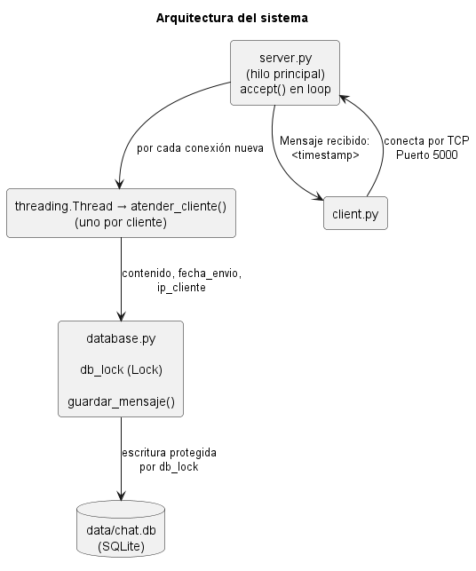

# PFO1 - Chat Básico Cliente/Servidor con Sockets y SQLite

Práctica Formativa Obligatoria de **Programación sobre Redes**.

Implementa un chat cliente-servidor sobre sockets TCP/IP en Python. El
servidor recibe mensajes de texto, los almacena en una base de datos
SQLite y responde al cliente con una confirmación que incluye la fecha y
hora de recepción.

---

### 1. Requisitos

- **Python 3.9 o superior**

No se necesitan librerías externas: `socket`, `sqlite3` y `threading`
forman parte de la biblioteca estándar de Python. No hace falta correr
`pip install`.

Para verificar la versión instalada:

```bash
python3 --version
```

---

## 2. Estructura del proyecto

```
PFO1-chat-sockets/
│
├── server.py       # Servidor TCP/IP: sockets + hilos
├── client.py       # Cliente de consola
├── database.py     # Persistencia en SQLite (thread-safe)
├── config.py       # Constantes compartidas (host, puerto, ruta de la DB)
│
├── data/
│   └── chat.db     # se crea automáticamente al iniciar el servidor
│
├── tests/
│   └── test_chat.py     # suite completa de tests
├── pytest.ini           # configuración de pytest
│
├── README.md
└── .gitignore
```

La carpeta `data/` y el archivo `chat.db` se generan solos la primera vez
que se ejecuta el servidor, por eso no están versionados en el
repositorio.

---

### 3. Arquitectura




#### Implementación

* **Modularización.** Cada archivo tiene una única responsabilidad:
`server.py` maneja la red, `database.py` la persistencia, `config.py` las
constantes y `client.py` la interacción con el usuario. Si cambia el
puerto o la ruta de la base de datos, se hace en un solo lugar.

* **Cliente-Servidor sobre sockets TCP/IP.** El servidor abre un socket y
queda escuchando (`bind` + `listen` + `accept`), mientras que cada cliente
abre su propio socket y se conecta (`connect`).

* **Concurrencia con hilos.** Cada conexión aceptada se delega a un
`threading.Thread` propio (`atender_cliente`). Sin esto, el servidor
atendería a un solo cliente por vez y el resto quedaría bloqueado
esperando. Los hilos son `daemon=True` para que terminen automáticamente
al cerrar el servidor con `Ctrl + C`.

* **Exclusión mutua con `Lock`.** Como todos los hilos comparten el mismo
archivo `chat.db`, la escritura es un recurso compartido. Si dos hilos
escribieran al mismo tiempo podría producirse una condición de carrera.
Por eso `guardar_mensaje()` envuelve la operación en un
`threading.Lock()`: sólo un hilo a la vez puede entrar a esa **sección
crítica**.

* **Timestamp del lado del servidor.** La fecha y hora se genera en el
servidor y no en el cliente, para que el registro sea confiable y no
dependa del reloj de cada máquina cliente.

---

### 4. Cómo ejecutarlo (paso a paso)

> **Importante:** el servidor se levanta **primero**. Si se ejecuta el
> cliente sin el servidor corriendo, la conexión se rechaza.

#### Paso 1: Ubicarse en la carpeta del proyecto

```bash
cd PFO1-chat-sockets
```

#### Paso 2: Levantar el servidor (primera terminal)

```bash
py server.py
```

Salida esperada:

```
==================================================
Servidor iniciado
Escuchando en 127.0.0.1:5000
Presioná Ctrl + C para detenerlo
==================================================
```

Dejar esta terminal abierta y corriendo.

#### Paso 3: Ejecutar el cliente (segunda terminal)

Abrir **otra** terminal, en la misma carpeta:

```bash
py client.py
```

#### Paso 4: Enviar mensajes

```
Escribí un mensaje (o 'éxito' para salir): hola
Servidor: Mensaje recibido: 2026-09-16 18:32:12

Escribí un mensaje (o 'éxito' para salir): segundo mensaje
Servidor: Mensaje recibido: 2026-09-16 18:32:20

Escribí un mensaje (o 'éxito' para salir): éxito
Cerrando cliente...
```

#### Paso 5: Probar la concurrencia (opcional)

Abrir una **tercera** terminal y ejecutar otro `python3 client.py`
mientras el primero sigue conectado. Ambos clientes son atendidos en
simultáneo, cada uno en su propio hilo.

#### Paso 6: Detener el servidor

En la terminal del servidor, presionar `Ctrl + C`.

---

### 5. Verificar los mensajes almacenados

Con el servidor detenido:

```bash
py -c "
import sqlite3
conn = sqlite3.connect('data/chat.db')
for fila in conn.execute('SELECT * FROM mensajes'):
    print(fila)
"
```

Salida de ejemplo:

```
(1, 'hola', '2026-09-16 18:32:12', '127.0.0.1')
(2, 'segundo mensaje', '2026-09-16 18:32:20', '127.0.0.1')
```

### Esquema de la tabla

| Campo         | Tipo    | Descripción                          |
|---------------|---------|--------------------------------------|
| `id`          | INTEGER | Clave primaria autoincremental       |
| `contenido`   | TEXT    | Texto del mensaje enviado            |
| `fecha_envio` | TEXT    | Fecha y hora de recepción            |
| `ip_cliente`  | TEXT    | Dirección IP del cliente emisor      |

---

### 6. Manejo de errores

| Situación | Comportamiento |
|-----------|----------------|
| Puerto ocupado | El servidor captura el `OSError` del `bind()` y muestra un mensaje claro en lugar de un traceback. |
| Base de datos no accesible | Se captura `sqlite3.Error`; el servidor informa el problema y no arranca en un estado inconsistente. |
| Error al guardar un mensaje | Se avisa al cliente con un mensaje de error sin tirar abajo el servidor. |
| Cliente desconectado de golpe | Se captura `ConnectionResetError`; los demás clientes siguen siendo atendidos. |
| Servidor apagado al conectar | El cliente captura `ConnectionRefusedError` e indica que hay que iniciar `server.py`. |
| Reinicio inmediato del servidor | `SO_REUSEADDR` permite volver a usar el puerto sin esperar el estado TIME_WAIT. |
| `Ctrl + C` | El `settimeout(1.0)` evita que `accept()` quede bloqueado, permitiendo un cierre limpio del socket. |

---

### 7. Tests automáticos (pytest)

El proyecto incluye una suite de 15 tests con **pytest** en
`tests/test_chat.py`, que cubre tanto pruebas unitarias como de
integración.

#### Instalación

```bash
pip install pytest
```

#### Ejecución

Desde la raíz del proyecto:

```bash
python -m pytest tests/test_chat.py -v
```

> No hace falta levantar `server.py` manualmente antes: los tests que
> necesitan el servidor lo arrancan y lo apagan solos.

Para correr solo los tests rápidos, sin levantar el servidor (10 tests,
corren en milisegundos):

```bash
python -m pytest tests/test_chat.py -v -m unitario
```

Para correr solo los tests de integración, con el servidor real
(5 tests, tardan unos segundos por el arranque del proceso):

```bash
python -m pytest tests/test_chat.py -v -m integracion
```

El archivo `pytest.ini` en la raíz del proyecto es el que registra
esos dos markers (`unitario` / `integracion`).

#### Como se dividen los test

**Tests unitarios de `database.py`** (con una DB temporal, sin tocar
`data/chat.db`):
- que `inicializar_db()` cree la tabla con las columnas exactas que
  pide la consigna (`id`, `contenido`, `fecha_envio`, `ip_cliente`).
- que `guardar_mensaje()` persista los 3 campos correctamente y que el
  `id` autoincremente.
- que el `db_lock` evite pérdida de mensajes al escribir desde 20
  hilos en simultáneo (prueba directa de la sección crítica).

**Tests unitarios de `client.py`** (con un socket simulado, sin
conexión real):
- que un mensaje con contenido se envíe tal cual por el socket.
- que un mensaje vacío no se envíe.
- que el loop corte al escribir "éxito" en cualquier variante
  (con/sin tilde, mayúsculas).

**Tests de integración** (levantan `server.py` como proceso real):
- que la respuesta tenga el formato exacto `"Mensaje recibido: <timestamp>"`.
- que el mensaje enviado quede realmente guardado en `data/chat.db`.
- que un mismo cliente pueda mandar varios mensajes en la misma conexión.
- **que dos clientes conectados a la vez no se bloqueen entre sí**
  (valida que el `threading.Thread` por cliente funcione de verdad,
  no sólo que el código "se vea" concurrente).
- que levantar un segundo servidor con el puerto ocupado falle con un
  mensaje prolijo y no con un traceback.

Este último test de concurrencia se verificó deshaciendo a propósito el
`threading.Thread` en `server.py`: sin hilos, el test falla (el cliente 2
tarda ~3s en responder); con hilos, pasa (responde casi al instante). Así
queda demostrado que el test realmente mide lo que dice medir.

---
### ⭐**Autora:** Ailén Páez - Comisión E